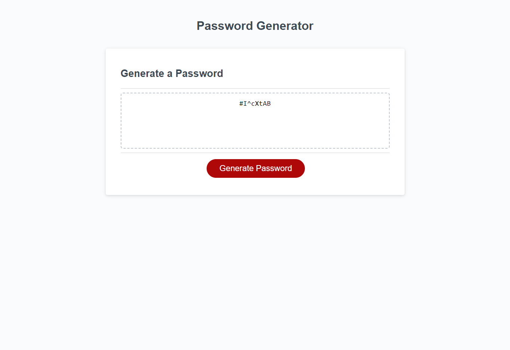

# <Password Generator Website>

## Description
This website is created to help generate new passwords by clicking the "Generate Password" button and following the prompts to recieve a secure password. The prompts will ask if the user is alright with Uppercase, Lowercase, Number, and Special characters. The reason for this build is to show an understanding of JavaScript and to create prompts to continue the flow of information so that a password can be generated.

## Usage

Click the button to begin the prompts for the Password Generator.

